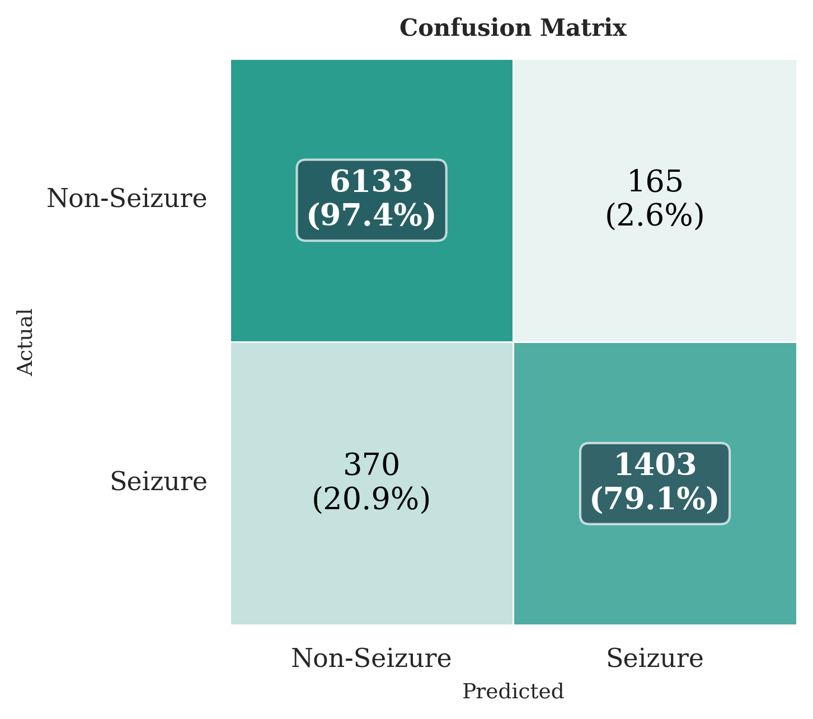

# Seizure Detection

A Python-based project aimed at detecting seizures using machine learning techniques. This repository encompasses data loading, preprocessing, model training, evaluation, and utility functions to facilitate the development and deployment of seizure detection models.

## Table of Contents

- [Overview](#overview)
- [Features](#features)
- [Installation](#installation)
- [Usage](#usage)
- [Model Performance](#model-performance)
- [Project Structure](#project-structure)
- [References](#references)
- [Contributing](#contributing)
- [License](#license)

## Overview

The goal of this project is to develop a robust system capable of detecting epileptic seizures from EEG data.

## Features

- **Data Handling**: Efficient loading and preprocessing (undersampling) of EEG datasets.
- **Model Management**: Modular architecture for training and evaluating various machine learning models.
- **Checkpointing**: Save and load model states to facilitate training resumption and deployment.
- **Utilities**: Helper functions to support data manipulation and model operations.

## Installation

1. **Clone the repository**:

   ```bash
   git clone https://github.com/blisssome/seizure_detection.git
   cd seizure_detection
   ```

2. **Create a virtual environment** (optional but recommended):

   ```bash
   python -m venv venv
   source venv/bin/activate  # On Windows: venv\Scripts\activate
   ```

3. **Install the required packages**:

   ```bash
   pip install -r requirements.txt
   ```

## Usage

1. **Configure the project**:

   Modify the `config.py` file to set parameters such as data paths, model configurations, and training hyperparameters.

2. **Prepare the dataset**:

   Ensure your dataset is structured appropriately and update the paths in `config.py` accordingly.

3. **Run the training script**:

   ```bash
   python main.py
   ```

   This will initiate the training process based on the configurations provided.

## Model Performance 

The project evaluates the performance of three distinct models for seizure detection. The F1 scores achieved by each model after 50 epochs are as follows:

| Model                          | F1 Score |
|-------------------------------|----------|
| Transformer                   | 0.92     |
| 1D Convolutional Neural Network (CNN1D) | 0.93     |
| 2D Convolutional Neural Network (CNN2D) | 0.91     |

To further analyze model performance, we present the confusion matrices for each architecture. These matrices provide insight into the model’s precision, recall, and types of errors.

### Transformer


### CNN1D


### CNN2D



## Project Structure

```
seizure_detection/
├── models/
│   └── ...           # Directory for model architectures
├── checkpoint_manager.py  # Handles saving and loading model checkpoints
├── config.py              # Configuration file for setting parameters
├── dataset.py             # Dataset class for loading data for training
├── loader.py              # Functions for data loading
├── main.py                # Main script to run training and evaluation
├── requirements.txt       # List of required Python packages
└── utils.py               # Utility functions
```
## References
I want personally thank this work for the suggestion of downsampling the EEG signal. From what I observe models usually fail on high-frequency signals. 

- Gramacki, A., & Gramacki, J. (2022). *A deep learning framework for epileptic seizure detection based on neonatal EEG signals*. Scientific Reports, 12, 13010. https://doi.org/10.1038/s41598-022-15830-2
## License

This project is licensed under the [MIT License](LICENSE).
